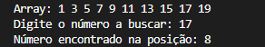
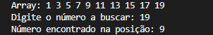
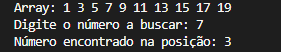

# Binary Search

Implementação em Java do algoritmo de busca binária. Ele serve para realizar buscas ordenadas de forma rápida e eficientes

## Como funciona

Busca um valor em um array ordenado, dividindo o intervalo de busca pela metade a cada iteração.

1. Compara o valor buscado com o elemento do meio (`mid`)
2. Se for igual, retorna o índice
3. Se o valor for maior, descarta a metade inferior (`low = mid + 1`)
4. Se o valor for menor, descarta a metade superior (`high = mid - 1`)
5. Repete até encontrar o valor ou o intervalo se esgotar (`low > high`)

## Onde é utilizado

- Busca em bancos de dados indexados
- Autocomplete e sugestões (busca em listas ordenadas)
- Sistemas de arquivos (busca de blocos/índices)
- Controle de versão (ex: `git bisect`, que encontra o commit que introduziu um bug)
- Estruturas de dados como árvores balanceadas (AVL, B-Trees) usam a mesma lógica internamente
- Qualquer cenário com dados ordenados e necessidade de busca rápida

## Número de passos

Como o intervalo é dividido pela metade a cada passo, o número máximo de comparações necessárias para encontrar (ou descartar) um elemento em um array de tamanho `n` é:

```
passos = log₂(n)
```

**Exemplo:** para um array com 1.000.000 de elementos, o binary search precisa de no máximo:

```
log₂(1.000.000) ≈ 20 passos
```

Comparado a uma busca linear, que no pior caso precisaria de 1.000.000 de passos.

## Pré-requisito

O array precisa estar ordenado. Caso contrário, o algoritmo não funciona corretamente.

## Uso

```bash
javac BinarySearch.java
java BinarySearch
```

## Exemplo



