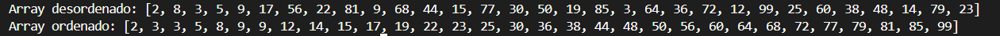

# QuickSort

Implementação em Java do algoritmo QuickSort (Ordenação Rápida). Um dos algoritmos de ordenação mais eficientes e utilizados na prática.

## Como funciona

O QuickSort ordena um array através de particionamento e recursão:

1. Escolhe um pivô (elemento divisor, geralmente o último)
2. Separa o array em dois grupos:
   - `esquerda`: elementos menores que o pivô
   - `direita`: elementos maiores que o pivô
3. Coloca o pivô no meio: `esquerda + pivô + direita`
4. Repete recursivamente para `esquerda` e `direita`
5. Para quando cada subarray tem apenas 1 elemento

## Onde é utilizado

- Ordenação geral: Python (Timsort), C++ (std::sort), Java (Arrays.sort)
- Bancos de dados: Índices e reorganização de dados
- Sistemas operacionais: Ordenação de arquivos e processos
- Análise de dados: Big Data processing
- Processamento de imagens: Ordenação de pixels
- Qualquer cenário que exija ordenação eficiente

### Eficiencia do quicksort

Exemplo: Para 1 milhão de elementos:
- QuickSort: ~20 milhões de operações
- Bubble Sort: ~1 trilhão de operações
- Diferença: 50.000 vezes mais rápido!

## Referências

Uma boa compreensão de ordenação abaixo com interações em tempo real!
- [Visualização interativa](https://visualgo.net/en/sorting)

## Exemplos

