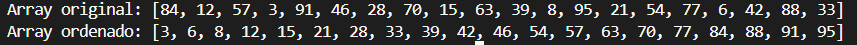

# Selection Sort
Implementação em Java do algoritmo de ordenação por seleção. Ele serve para ordenar um array de forma simples, selecionando repetidamente o menor elemento restante.

## Como funciona
Percorre o array várias vezes, a cada passada encontrando o menor elemento restante e movendo-o para a lista ordenada.

1. Percorre todos os elementos não ordenados
2. Encontra o menor valor entre eles
3. Remove esse valor e adiciona ao array ordenado
4. Repete até não restarem elementos

## Onde é utilizado
* Conjuntos de dados pequenos, onde simplicidade importa mais que performance
* Cenários com poucas trocas/escritas em memória (o algoritmo faz no máximo n trocas)
* Base didática para entender algoritmos de ordenação mais complexos
* Sistemas embarcados com memória limitada, onde a simplicidade de implementação compensa a ineficiência

## Número de passos
Para cada elemento, é necessário percorrer o restante do array em busca do menor valor. Isso resulta em complexidade:

~~~
passos = n²
~~~

Exemplo: para um array com 1.000 elementos, o selection sort precisa de aproximadamente:

~~~
1.000² = 1.000.000 comparações
~~~

Selection Sort, ele é um dos algoritmos mais básicos de seleção, por isso o n².

## Pré-requisito
Nenhum. Funciona em qualquer array, ordenado ou não.

## Exemplos

